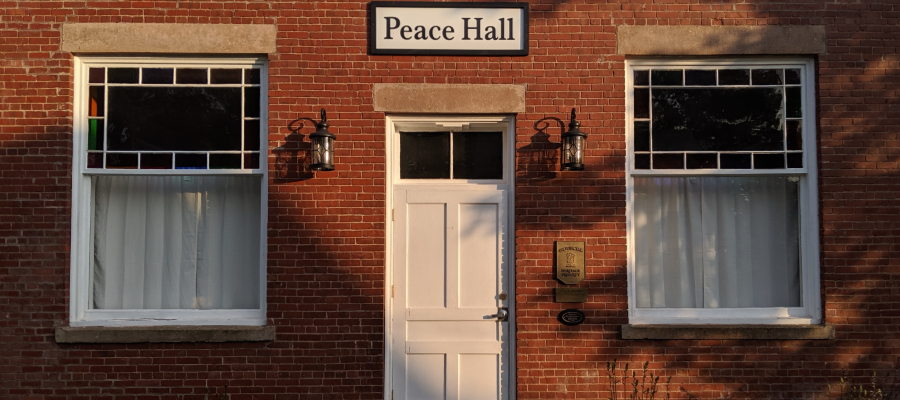

This page contains all the current and past banners used for my website's landing page. The images are listed in reverse chronological order. All photos are taken by me unless otherwise credited.

##### Peace Hall, Pugwash, Nova Scotia.

This photo was taken in Pugwash, Nova Scotia in the Summer of 2019 after I defended my dissertation, which included a chapter on the Pugwash movement. This is the site of [the first Pugwash Conference](https://pugwashconferences.files.wordpress.com/2014/02/1957_pugwash_group.jpg "Group photo from the first Pugwash Conference.") which took place in July, 1957. I did abolutely no field work during this trip.

##### Taos Pueblo, New Mexico.

This photo was taken at Taos Pueblo in New Mexico in the Fall of 2017 when I attended the International Conference of the Computational Social Science Society of the Americas in Santa Fe, New Mexico.

