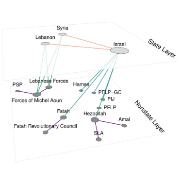
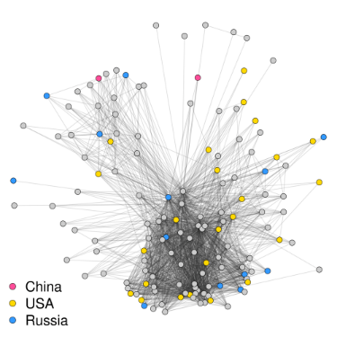
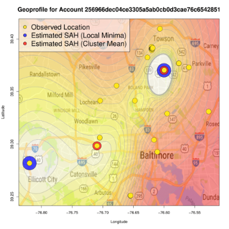
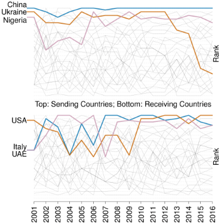

    

        <ul class="nav pull-right">
            <li><a href="#Dissertation">Dissertation Project: Multilayer Networks</a></li>
            <li><a href="#Publications">Publications</a></li>
            <li><a href="#Ongoing Projects">Ongoing Projects</a></li>
        </ul>
    

### Dissertation Project: Multilayer Networks in Political Science

My dissertation focuses on methods for working with multilayer network representations of complex interdependent systems. I apply these methods to examine the influence transnational actors have on international cooperation.

    

        

		<h5>Statistical Inference for Multilayer Networks in Political Science</h5>
		<b>Abstract</b> Interactions between units in political systems often occur across multiple relational contexts. These relational systems feature interdependencies that result in inferential shortcomings and poorly-fitting models when ignored. General advancements in inferential network analysis have improved our ability to understand relational systems featuring interdependence, but developments specific to working with interdependence that cross relational contexts remain sparse. In this paper, I introduce a multilayer network approach to modeling systems comprising multiple relations using the exponential random graph model (ERGM). In two substantive applications, the first a policy communication network and the second a global conflict network, I demonstrate that the multilayer approach affords inferential leverage and produces models that better fit observed data.
			<ul>
             <li><a href="{{ BASE_PATH }}/assets/papers/(2019) Chen - Statistical Inference for Multilayer Networks.pdf">Paper</a> accepted at _Political Science Research and Methods</li>
             <li>Posters for <a href="{{ BASE_PATH }}/assets/posters/chen_multilayer_polnet2018.pdf">PolNet 2018</a> and <a href="{{ BASE_PATH }}/assets/posters/chen_multilayer_polmeth2018.pdf">PolMeth 2018</a></li>
			 <li><a href="https://github.com/tedhchen/multilayer.ergm">GitHub Repository</a> for the companion R package multilayer.ergm (<a href="{{ BASE_PATH }}/pages/policy_multiplex.html">Tutorial link</a>)</li>
			</ul>
        

        

            
        

    

 

    

        

		<h5>Transnational Scientific Communities Facilitate Cooperation in the International Nuclear Regime: Evidence from the Pugwash Movement</h5>
		<b>Abstract</b> In this paper I show how transnational scientists influence international cooperation on nuclear treaties. I propose a delegation-based theory for how the transnational scientific community can influence state behavior by providing informational resources to help governments overcome hurdles to cooperation. Internationalist-oriented scientists obtain these informational resources by engaging each other through informal diplomacy. At the same time, they are constrained by what states consider to be permissible, which results in the observed bidirectional influence between state and scientist behavior. In the empirical analysis, I create a network data set from archival data on the Pugwash movement, a transnational community of scientists lobbying for increased extranational control over nuclear technology. I jointly model the international nuclear treaties and transnational Pugwash networks as a multilayer network. Results indicate that mutual reinforcement between the two sets of cooperative ties is a generative feature of the network. Additional evidence showing that results are stronger in open political systems, which afford scientists access to state officials, provides support for the proposed informational mechanism behind this relationship.
			<ul>
             <li><a href="{{ BASE_PATH }}/assets/posters/chen_pugwash_polmeth2019.pdf">Poster</a> for Polmeth 2019</li>
			</ul>
        

        

            
        

    

 

---
### Publications

    

        

		<h5>Reconstructing and Analyzing the Transnational Human Trafficking Network</h5>
			<ul>
			 <li>Peer-reviewed paper published in Proceedings of the 2019 IEEE/ACM International Conference on Advances in Social Networks Analysis and Mining</li>
			 <li>Coauthored with <a href="https://mitchellgoist.github.io/">Mitchell Goist</a> and <a href="http://cboylan.com/">Christopher Boylan</a></li>
			</ul>
		<h5>Social Activity Hubs: Estimating User Specific Contextual Factors from Social Media Data</h5>
			<ul>
             <li><a href="{{ BASE_PATH }}/assets/papers/(2017) Chen Zachary Fariss - Social Activity Hubs.pdf">Peer-reviewed paper</a> published in <a href="https://dl.acm.org/citation.cfm?id=3145606">Proceedings of the 2017 International Conference of The Computational Social Science Society of the Americas</a></li>
			 <li>Coauthored with Paul Zachary and <a href="http://cfariss.com/">Christopher Fariss</a></li>
			</ul>
		<h5>Policy-Balancing and Ticket-Splitting: Problems with ‘Preference for Checks and Balances’ in Taiwanese Electoral Studies</h5>
			<ul>
             <li>Paper published in <a href="https://www.cambridge.org/core/journals/japanese-journal-of-political-science/article/policybalancing-and-ticketsplitting-problems-with-preference-for-checks-and-balances-in-taiwanese-electoral-studies/3206097B92947CF4EF34026CDF174A70">Japanese Journal of Political Science</a></li>
			 <li>Coauthored with <a href="https://github.com/tzuliu">Tzu-Ping Liu</a> and Chung-li Wu</li>
			</ul>
		<h5>Public–Private Partnerships for the Development of Disaster Resilient Communities</h5>
			<ul>
             <li>Paper published in <a href="https://onlinelibrary.wiley.com/doi/abs/10.1111/1468-5973.12021">Journal of Contingencies and Crisis Management</a></li>
			 <li>Coauthored with Justine Chen, <a href="https://blogs.ubc.ca/ivertinsky/">Ilan Vertinsky</a>, Lilia Yumagulova, and <a href="http://www.business.mun.ca/why-us/meet-our-people/faculty-instructor-profiles/chansoo-park.php">Chansoo Park</a></li>
			</ul>
        

        

            
        

    

 

----

### Ongoing Projects

##### The Effect of Disaster-induced Displacement on Social and Political Behaviour: The Case of Hurricane Harvey
<ul>
	<li>Collaborative project with <a href="http://cfariss.com">Christopher Fariss</a> and <a href="http://sites.psu.edu/xuxu/">Xu Xu</a></li>
	<li><a href="{{ BASE_PATH }}/assets/papers/Chen Fariss Xu - Disaster-induced Displacement.pdf">Working Paper</a> and <a href="{{ BASE_PATH }}/assets/presentations/chenfarissxu_harvey_mpsa2019.pdf">Presentation</a> for the <a href="https://rubenson.org/events/tpbw2018/">2018 Toronto Political Behaviour Workshop</a> and the 2019 Midwest Political Science Association Meeting</li>
	<li><a href="https://www.nsf.gov/awardsearch/showAward?AWD_ID=1760644">NSF Award</a></li>
</ul>

    

        

		<h5>Who Protests? Using Social Media Data to Solve Ecological Inference Problems in Studies of Mass Behavior</h5>
			<ul>
			 <li>Collabrative project with Paul Zachary and <a href="http://cfariss.com/">Christopher Fariss</a></li>
			</ul>
		<h5>Inferential Analysis of the Supreme Court Citation Network</h5>
			<ul>
		<li>Collaborative project with <a href="https://sites.psu.edu/cxs5700">Christian Schmid</a>, <a href="http://brucedesmarais.com">Bruce Desmarais</a>, and <a href="http://personal.psu.edu/drh20">David Hunter</a></li>
		<li><a href="https://github.com/desmarais-lab/Supreme_Court_Citation_Network">GitHub Repository</a></li>
		<li><a href="{{ BASE_PATH }}/assets/presentations/schmidetal_scc_apsa2018.pdf">Presentation</a> for APSA 2018</li>
			</ul>
		<h5>How Does the Historical Legacy of Local Level Casualties Affect Public Opinion of War?</h5>
			<ul>
             <li>Collaborative project with <a href="https://chuyuliu.weebly.com">Chuyu Liu</a> and <a href="http://www.kevinreuning.com/">Kevin Reuning</a></li>
			</ul>
		<h5>Formal and Informal Diplomacy in the Asia Pacific Region, 1993-2008</h5>
			<ul>
			<li><a href="{{ BASE_PATH }}/assets/presentations/chen_asiapacific_apsa2017.pdf">Presentation</a> for APSA 2017</li>
			</ul>
        

        

            
        

    

 

---
