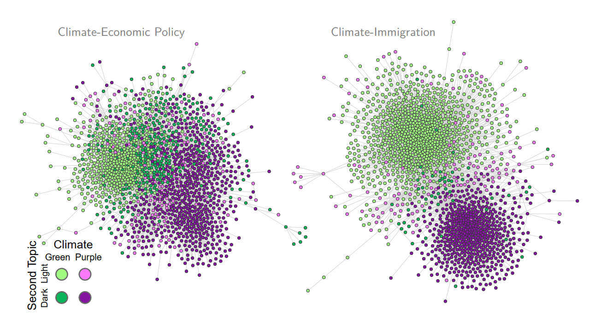
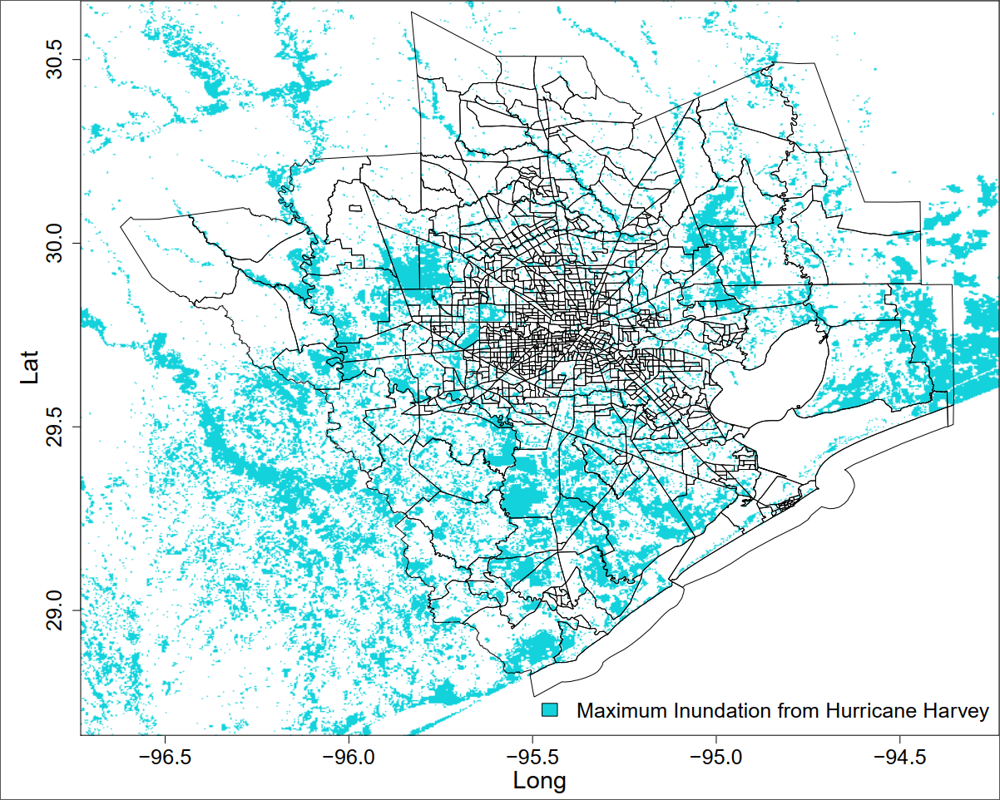
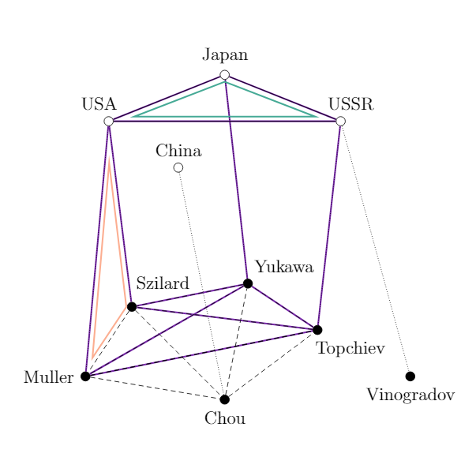
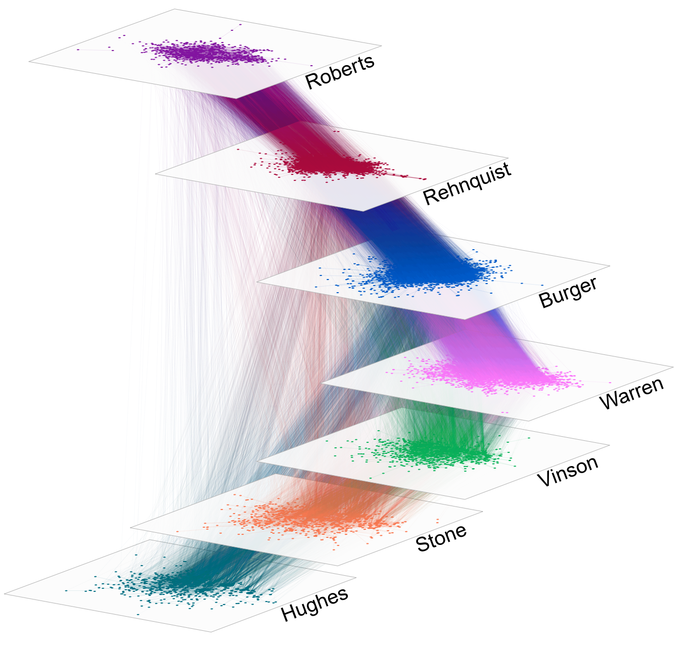

    

        <ul class="nav pull-right">
			<li><a href="#Climate Politics">Climate Politics</a></li>
            <li><a href="#Network Models of International Systems">Network Models of International Systems</a></li>
            <li><a href="#Other Work">Other Work</a></li>
        </ul>
    

This page shows my research by topics. For a chronological summary of my publications, please see my [curriculum vitae]({{ BASE_PATH }}/assets/chen_cv.pdf){:target="_blank"}.

----

### Climate Politics

My work in the area of climate politics focuses on the social consequences of climate change and the efforts to stem these negative and often conflictual outcomes.

    

		

			
        

	

    

        

		<h5>Polarization of Climate Politics Results from Partisan Sorting: Evidence from Finnish Twittersphere</h5>
		<b>Abstract</b> Prior research shows that public opinion on climate politics sorts along partisan lines. However, they leave open the question of whether climate politics and other politically salient issues exhibit tendencies for issue alignment, which the political polarization literature identifies as among the most deleterious aspects of polarization. Using a network approach and social media data from the Twitter platform, we study polarization of public opinion toward climate politics and ten other politically salient topics during the 2019 Finnish elections as the emergence of opposing groups in a public forum. We find that while climate politics is not particularly polarized compared to the other topics, it is subject to partisan sorting and issue alignment within the universalist-communitarian dimension of European politics that arose following the growth of right-wing populism. Notably, climate politics is consistently aligned with the immigration issue, and temporal trends indicate that this phenomenon will likely persist.
			<ul>
				<li>Paper published in <a href="https://doi.org/10.1016/j.gloenvcha.2021.102348" target="_blank" rel="noreferrer"><i>Global Environmental Change</i></a></li>
				<li>2021 Best Conference Paper Award, Political Networks Section, American Political Science Association</li>
				<li><a href="https://youtu.be/1tKHfqyC9OY" target="_blank" rel="noreferrer">Video presentation</a> for <a href="https://pcnsatellitenetsci.wixsite.com/workshop" target="_blank" rel="noreferrer">Political Communication Networks Workshop 2020</a> (<a href="{{ BASE_PATH }}/presentations/pcnet20_slides.pdf" target="_blank">Slides</a>)</li>
				<li>Coauthored with Ali Salloum, <a href="https://researchportal.helsinki.fi/en/persons/antti-gronow" target="_blank" rel="noreferrer">Antti Gronow</a>, <a href="https://researchportal.helsinki.fi/en/persons/tuomas-yl%C3%A4-anttila" target="_blank" rel="noreferrer">Tuomas Yla-Anttilä</a>, and <a href="http://www.mkivela.com/" target="_blank" rel="noreferrer">Mikko Kivelä</a></li>
			</ul>
		<h5>Income-based Inequality in Post-disaster Migration is Lower in High Resilience Areas: Evidence from U.S. Internal Migration</h5>
		<b>Abstract</b> Residential relocation following environmental disasters is an increasingly necessary climate change adaptation measure. However, relocation is among the costliest individual-level adaptation measures, meaning that it may be cost prohibitive for disadvantaged groups. As climate change continues to worsen, it is important to better understand how existing socioeconomic inequalities affect climate migration and how they may be offset. In this study we use network regression models to look at how internal migration patterns in the United States vary by disaster-related property damage, household income, and local-level disaster resilience. Our results show that post-disaster migration patterns vary considerably by the income level of sending and receiving counties, which suggests that income-based inequality impacts both individuals' access to relocation and the ability of disaster-afflicted areas to rebuild. We further find evidence that income-based inequality in post-disaster outmigration is attenuated in areas with higher disaster resilience, not due to increased relocation out of poorer areas but instead because there is decreased relocation from richer ones. This finding suggests that, as climate adaptation measures, relocation and resilience-building are substitutes, with the implication that resilience incentivizes in situ adaptation, which can be a long term drain on individual wellbeing and climate adaptation resources.
			<ul>
				<li>Paper published in <a href="https://doi.org/10.1088/1748-9326/ac5692" target="_blank" rel="noreferrer"><i>Environmental Research Letters</i></a></li>
				<li><a href="{{ BASE_PATH }}/presentations/chenlee_apsa21.pdf" target="_blank" rel="noreferrer">Presentation</a> for APSA 2021</li>
				<li>Coauthored with <a href="https://boyoonlee.com" target="_blank" rel="noreferrer">Boyoon Lee</a></li>
			</ul>
		

	

    

        

		<h5>Exposure to Natural Disasters Mobilizes Voting: Evidence from Hurricane Harvey in Houston</h5>
			<ul>
				<li>Coauthored with <a href="http://cfariss.com" target="_blank" rel="noreferrer">Christopher Fariss</a> and <a href="https://xu-xu.net/" target="_blank" rel="noreferrer">Xu Xu</a></li>
				<li><a href="{{ BASE_PATH }}/assets/papers/Chen_Fariss_Xu_Disaster-induced_Displacement.pdf" target="_blank">Working Paper</a> and <a href="{{ BASE_PATH }}/presentations/chenfarissxu_harvey_mpsa2019.pdf" target="_blank">Presentation</a> for the <a href="https://rubenson.org/events/tpbw2018/" target="_blank" rel="noreferrer">2018 Toronto Political Behaviour Workshop</a> and MPSA 2019</li>
				<li><a href="https://www.nsf.gov/awardsearch/showAward?AWD_ID=1760644" target="_blank" rel="noreferrer">NSF Award</a></li>
			</ul>
		<h5>Spread of Tweets in Climate Discussions: A Case Study of the 2019 Nobel Peace Prize Announcement</h5>
			<ul>
				<li>Paper published in <a href="https://doi.org/10.2478/njms-2021-0006" target="_blank" rel="noreferrer"><i>Nordic Journal of Media Studies</i></a></li>
				<li>Coauthored with Yan Xia and <a href="http://www.mkivela.com/" target="_blank" rel="noreferrer">Mikko Kivelä</a></li>
			</ul>		
        

        

            
        

    

 

    

		

		<h5>Public–Private Partnerships for the Development of Disaster Resilient Communities</h5>
			<ul>
				<li>Paper published in <a href="https://doi.org/10.1111/1468-5973.12021" target="_blank" rel="noreferrer"><i>Journal of Contingencies and Crisis Management</i></a></li>
				<li>Coauthored with Justine Chen, <a href="https://blogs.ubc.ca/ivertinsky/" target="_blank" rel="noreferrer">Ilan Vertinsky</a>, Lilia Yumagulova, and <a href="https://www.business.mun.ca/our-people/faculty-instructors/chansoo-park.php" target="_blank" rel="noreferrer">Chansoo Park</a></li>
			</ul>
		

    

 
----

### Network Models of International Systems

Work in this category include papers from my dissertation project, which uses multilayer network models to demonstrate that transnational actors are influential for international cooperation.

    

        

		<h5>Statistical Inference for Multilayer Networks in Political Science</h5>
		<b>Abstract</b> Interactions between units in political systems often occur across multiple relational contexts. These relational systems feature interdependencies that result in inferential shortcomings and poorly-fitting models when ignored. General advancements in inferential network analysis have improved our ability to understand relational systems featuring interdependence, but developments specific to working with interdependence that cross relational contexts remain sparse. In this paper, I introduce a multilayer network approach to modeling systems comprising multiple relations using the exponential random graph model (ERGM). In two substantive applications, the first a policy communication network and the second a global conflict network, I demonstrate that the multilayer approach affords inferential leverage and produces models that better fit observed data.
			<ul>
             <li><a href="https://doi.org/10.31235/osf.io/m5h9s" target="_blank">Paper</a> published in <a href="https://doi.org/10.1017/psrm.2019.49" target="_blank" rel="noreferrer"><i>Political Science Research and Methods</i></a></li>
             <li>Posters for <a href="{{ BASE_PATH }}/assets/posters/chen_multilayer_polnet2018.pdf" target="_blank">PolNet 2018</a> and <a href="{{ BASE_PATH }}/assets/posters/chen_multilayer_polmeth2018.pdf" target="_blank">PolMeth 2018</a></li>
			 <li><a href="https://github.com/tedhchen/multilayer.ergm" target="_blank" rel="noreferrer">GitHub Repository</a> for the companion R package multilayer.ergm (<a href="{{ BASE_PATH }}/pages/policy_multiplex.html" target="_blank">Tutorial link</a>)</li>
			</ul>
		

		

			
        

	

    

        

		<h5>Reconstructing and Analyzing the Transnational Human Trafficking Network</h5>
		<b>Abstract</b> Human trafficking is a global problem which impacts a countless number of individuals every year. In this project, we demonstrate how machine learning techniques and qualitative reports can be used to generate new valuable quantitative information on human trafficking. Our approach generates original data, which we release publicly, on the directed trafficking relationship between countries that can be used to reconstruct the global transnational human trafficking network. Using this new data and statistical network analysis, we identify the most influential countries in the network and analyze how different factors and network structures influence transnational trafficking. Most importantly, our methods and data can be employed by policymakers, non-governmental organizations, and researchers to help combat the problem of human trafficking.
			<ul>
			 <li>Peer-reviewed paper published in <a href="https://dl.acm.org/doi/10.1145/3341161.3342879" target="_blank" rel="noreferrer"><i>Proceedings of the 2019 IEEE/ACM International Conference on Advances in Social Networks Analysis and Mining</i></a></li>
			 <li>Coauthored with <a href="https://mitchellgoist.github.io/" target="_blank" rel="noreferrer">Mitchell Goist</a> and <a href="http://cboylan.com/" target="_blank" rel="noreferrer">Christopher Boylan</a></li>
			</ul>
        

		

            
        

    

 

    

        

		<h5>Informal Diplomacy Reinforces Formal International Cooperation: Evidence from Track Two Diplomacy</h5>
		<b>Abstract</b> Track two diplomacy is the set of government-sanctioned but informal diplomatic activities that are intended to overcome difficulties associated with formal diplomacy. Track two meetings should complement official diplomacy because they are external to the government apparatus and have low public visibility, insulating governments from unwanted commitment and attention. While track two meetings are a prevalent diplomatic tool, empirical examinations of their effectiveness using larger-scale statistical approaches are rare. Using a multilayer network approach, I explore the relationship between official and track two diplomacy in the Asia Pacific region using a new network data set constructed from diplomatic meeting records. Results indicate that the two tracks of diplomacy are mutually reinforcing, which suggests that track two diplomacy is effective in facilitating formal international cooperation. Further examination finds evidence to support the notion that states strategically select between different tracks of diplomacy to avoid being publicly tied to unpalatable opponents.
			<ul>
             <li><a href="https://doi.org/10.31235/osf.io/647gt" target="_blank" rel="noreferrer">Preprint</a></li>
			</ul>
        

    

 

    

        

		<h5>Transnational Scientific Communities Facilitate Cooperation in the International Nuclear Regime: Evidence from the Pugwash Movement</h5>
		<b>Abstract</b> In this paper I show how transnational scientists influence international cooperation on nuclear treaties. I propose a delegation-based theory for how the transnational scientific community can influence state behavior by providing informational resources to help governments overcome hurdles to cooperation. Internationalist-oriented scientists obtain these informational resources by engaging each other through informal diplomacy. At the same time, they are constrained by what states consider to be permissible, which results in the observed bidirectional influence between state and scientist behavior. In the empirical analysis, I create a network data set from archival data on the Pugwash movement, a transnational community of scientists lobbying for increased extranational control over nuclear technology. I jointly model the international nuclear treaties and transnational Pugwash networks as a multilayer network. Results indicate that mutual reinforcement between the two sets of cooperative ties is a generative feature of the network. Additional evidence showing that results are stronger in open political systems, which afford scientists access to state officials, provides support for the proposed informational mechanism behind this relationship.
			<ul>
             <li><a href="{{ BASE_PATH }}/assets/posters/chen_pugwash_polmeth2019.pdf" target="_blank">Poster</a> for Polmeth 2019</li>
			</ul>
        

        

            
        

    

 

----

### Other Work

    

        

		<h5>Generative Dynamics of Supreme Court Citations: Analysis with a New Statistical Model</h5>
			<ul>
				<li>Paper published in <a href="https://doi.org/10.1017/pan.2021.20"><i>Political Analysis</i></a></li>
				<li>Coauthored with <a href="https://sites.psu.edu/cxs5700" target="_blank" rel="noreferrer">Christian Schmid</a> and <a href="http://brucedesmarais.com" target="_blank" rel="noreferrer">Bruce Desmarais</a></li>
				<li><a href="https://github.com/schmid86/cERGM" target="_blank" rel="noreferrer">GitHub Repository</a> for companion R package cERGM</li>
				<li><a href="{{ BASE_PATH }}/presentations/schmidetal_scc_apsa2018.pdf" target="_blank">Presentation</a> for APSA 2018</li>
			</ul>
		<h5>Social Activity Hubs: Estimating User Specific Contextual Factors from Social Media Data</h5>
			<ul>
				<li><a href="{{ BASE_PATH }}/assets/papers/2017_Chen_Zachary_Fariss_Social_Activity_Hubs.pdf" target="_blank">Peer-reviewed paper</a> published in <a href="https://dl.acm.org/citation.cfm?id=3145606" target="_blank" rel="noreferrer"><i>Proceedings of the 2017 International Conference of The Computational Social Science Society of the Americas</i></a></li>
				<li>Coauthored with Paul Zachary and <a href="http://cfariss.com/" target="_blank" rel="noreferrer">Christopher Fariss</a></li>
			</ul>
		<h5>The Elephant in the Voting Booth?: Assessing the Effect of the 2005 Taiwanese Electoral Reform in Reducing Vote-Buying and Local Factional Politics</h5>
			<ul>
				<li>Paper published in <a href="https://doi.org/10.1525/as.2021.61.4.641" target="_blank" rel="noreferrer"><i>Asian Survey</i></a></li>
				<li>Coauthored with Chung-li Wu</li>
			</ul>
        

		

            
        

	

    

		

		<h5>Policy-Balancing and Ticket-Splitting: Problems with ‘Preference for Checks and Balances’ in Taiwanese Electoral Studies</h5>
			<ul>
				<li>Paper published in <a href="https://doi.org/10.1017/S1468109914000097" target="_blank" rel="noreferrer"><i>Japanese Journal of Political Science</i></a></li>
				<li>Coauthored with <a href="https://tzuliu.github.io/tpphd/" target="_blank" rel="noreferrer">Tzu-Ping Liu</a> and Chung-li Wu</li>
			</ul>
		<h5>Exposure to Discretionary Arrests increases Support for Anti-Police Protests</h5>
		<b>Abstract</b> The legitimacy of the state rests on individuals' perceptions of fairness when interacting with state institutions and state agents. Though a citizen will accept sanctions from the state and its agents when the benefits of enforced outcomes outweigh relinquished freedoms, fairness is essential to maintain this agreement. The police as an institution and as individual agents have wide latitude to detain and use force against individuals. We study support for and the legitimacy of policing in the context of the anti-police protests in Baltimore, MD following the death of Freddie Gray in April, 2015. Using data from police records and social media, we show that individuals with higher exposure to discretionary arrests --- arrests that are potentially viewed as illegitimate or arbitrary --- are more likely to support protests against the police. In contrast, we demonstrate that exposure to arrests for major crimes such as murder, does not follow the same pattern. Thus support for the police as an institution varies systematically with exposure to arbitrary and capricious encounters with police agents. As these grievance generating encounters become more widespread, we expect to see increased protests against the police and further erosion in support of the police as an institution. Alternatively, shifting institutional resources to focus on major crimes and limiting the discretionary authority of police agents when interacting with the public may help to repair the legitimacy of policing institutions over the long term.
			<ul>
			 <li><a href="https://doi.org/10.31235/osf.io/r78ys" target="_blank" rel="noreferrer">Working paper</a> coauthored with <a href="http://cfariss.com/" target="_blank" rel="noreferrer">Christopher Fariss</a> and Paul McLachlan</li>
			</ul>
		

    

 

----
